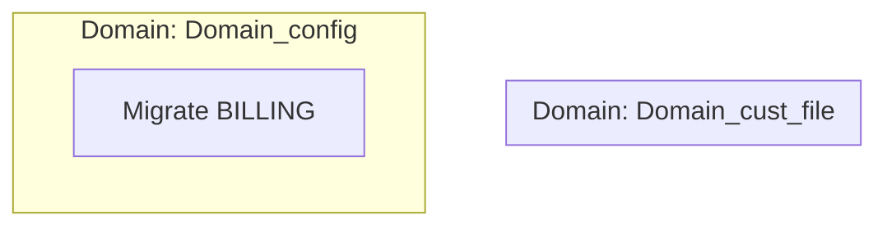

# Digital Review Packet & Modernization Blueprint

> **Generated from Requirements Graph**: `requirements_graph.json`  
> **Collaboration Mode**: Git & Fileshare (Serverless)  
> **Migration Paradigm**: **STRUCTURAL** (Match Code)

## Table of Contents

1. [Migration Paradigm](#migration-paradigm)
2. [Architecture Overview](#architecture-overview)
3. [Domain: Domain_cust_file](#domain-domain_cust_file)
4. [Domain: Domain_config](#domain-domain_config)
5. [Rigid Sign-off Gate Checklist](#rigid-sign-off-gate-checklist)

## Migration Paradigm

This project is executing under **Match Code** mode. Legacy modules are migrated 1-to-1 to maintain structural equivalence and minimize conversion risk. For details, see [CODE_VS_FUNCTIONAL.md](CODE_VS_FUNCTIONAL.md).

## Architecture Overview

Below is the logical relationship flow between requirements and domains:

---

## Domain: Domain_cust_file

### Logical Data Entities

#### Entity: CUST-FILE
*Logical entity derived from legacy asset: CUST-FILE*

| Field | Type | Description |
|---|---|---|
| id | string | Primary identifier |
---

## Domain: Domain_config

### Logical Data Entities

#### Entity: CONFIG
*Logical entity derived from legacy asset: CONFIG*

| Field | Type | Description |
|---|---|---|
| id | string | Primary identifier |

#### Entity: CUST-FILE
*Logical entity derived from legacy asset: CUST-FILE*

| Field | Type | Description |
|---|---|---|
| id | string | Primary identifier |

### Functional Requirements

#### [REQ_BILLING] Migrate BILLING

**Business Logic Description**:
Functional rules and processing logic for BILLING (Source: cobol - BILLING.cbl). [TBD: Extract business rules via LLM]

**Data Entities Accessed**:
`CONFIG`, `CUST-FILE`

**Legacy Source Components**:
`cobol:BILLING`

**Dependencies**:
*None*

---

## Rigid Sign-off Gate Checklist

To record your approval, run the `anti-legacy:gatekeeper` command or record an attestation in `.anti-legacy/evidence/` via git.

| Gate ID | Description | Required Roles | Status |
|---|---|---|---|
| **GATE_1_DESIGN** | Review and sign-off on target Requirements Graph | Lead Architect, Lead Developer | `PENDING` |
| **GATE_2_PLAN** | Review and sign-off on the generated execution plan | Product Manager, Tech Lead | `PENDING` |
| **GATE_3_BUILD** | Automated verification of test-parity and LSP syntax | Deterministic (Compiler) | `PENDING` |
| **GATE_4_UAT** | Independent UAT Reviewer validation of target requirements | UAT Lead, Business Analyst | `PENDING` |